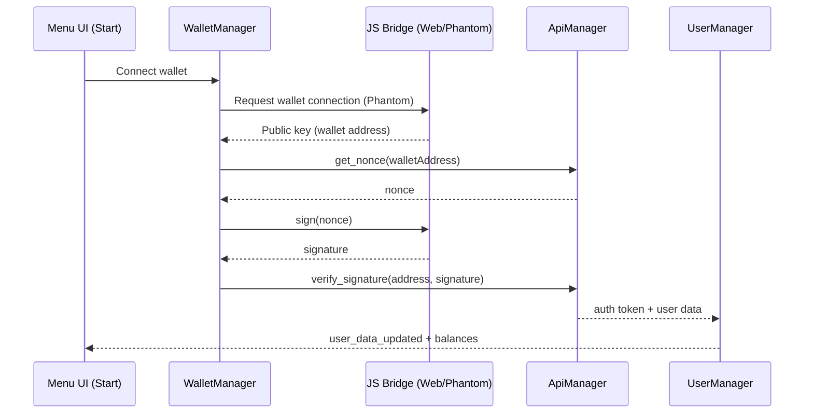
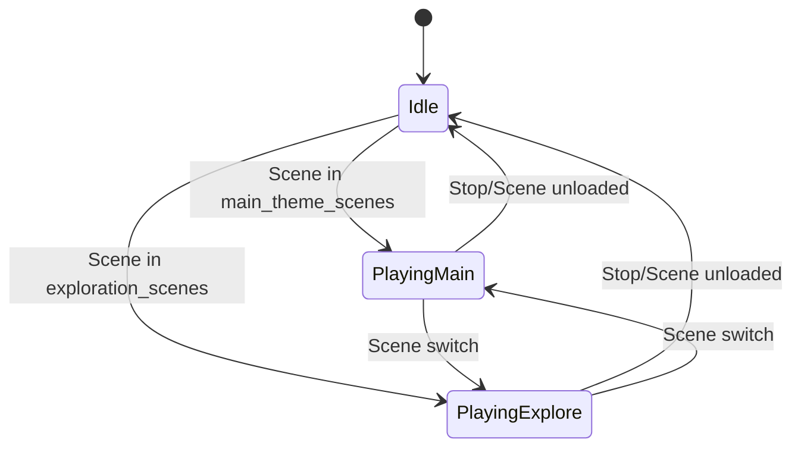

# Architecture Overview

This document explains the overall architecture for the Monster Cocktails projects (Godot 4.5). All diagrams are in English and rendered with Mermaid.

Project composition
- Monster-Cocktails-Main/Monster-Cocktails-Main — active development project
- Monster-Cocktails-Menu/cryptocatchers-... — snapshot variant with similar structure

Top-level modules
- Scenes: gameplay, menu, search, converter, selling spot, loading
- Autoloads (global singletons): transitions, HUD, wallet/auth/API, user, inventory, music
- Addons: GodotTogether (optional multiplayer + collaboration)
- Assets: dependencies (backgrounds, monsters, character anims, UI controls)

Autoloads (Main)
Defined in Monster-Cocktails-Main/Monster-Cocktails-Main/project.godot:
- Globals (globals.gd)
- SceneTransition (SceneTransition.gd)
- SceneInOut (SceneInOut.gd)
- CurrencyDisplay (Currency/currency_display.tscn)
- WalletManager (wallet_manager.gd)
- ApiManager (api_manager.gd)
- UserManager (user_manager.gd)
- MusicManager (MusicManager/music_manager.gd)
- GlobalInventory (Game/fixed/global_inventory_fixed.gd)

High‑level component diagram
```mermaid
flowchart LR
  subgraph Scenes
    Menu[Menu.tscn]
    Gameplay[Gameplay.tscn]
    Search[SearchGame/search_game.tscn]
    Convert[Convertor/Convert.tscn]
    Selling[selling-spot/selling-spot.tscn]
    Loading[Loading-Dependencies/loading.tscn]
  end

  SceneTransition[SceneTransition (fade)]
  SceneInOut[SceneInOut (zoom)]
  HUD[CurrencyDisplay]
  Inv[GlobalInventory]
  Music[MusicManager]
  Wallet[WalletManager]
  API[ApiManager]
  User[UserManager]

  Menu -->|Start| Gameplay
  Menu -->|Other modes| Search
  Menu --> Convert
  Menu --> Selling

  Scenes -->|fade/zoom| SceneTransition
  Scenes -->|fade/zoom| SceneInOut
  Scenes -->|overlay| HUD
  Scenes <--> Inv
  Scenes --> Music
  Scenes --> Wallet
  Wallet --> API --> User --> Scenes

  subgraph Addon[GodotTogether]
    GDTClient
  end
  Scenes <--> GDTClient

  API -->|HTTPS| Backend[(Monster Cocktails API)]
```

Authentication flow


Music selection logic
- MusicManager listens to scene changes and selects between:
  - main_theme for scenes: Menu, Gameplay
  - exploration_theme for scenes: SearchGame, selling-spot, Convertor
- Can limit playback length per track and loop based on exported settings.



Inventory responsibilities
- Track counts for monsters and cocktails.
- Track currency (coins) and optionally SOL.
- Emit signals on change: monster_added/removed, cocktail_added/removed, coins_changed.
- Provide pricing tables for cocktails and monsters.
- Integrates with Converter UI and gameplay pickups.

Scene transition services
- SceneTransition.gd: fade in/out and atomic scene change.
- SceneInOut.gd: camera zoom in/out across scene change.

Networking (addon)
- GodotTogether `GDTClient` handles client‑side connection, file sync (optional), and user list.
- Integration is optional; not required for single‑player gameplay.

Rendering and window
- GL Compatibility renderer.
- 1920x1080 viewport default; stretch mode "viewport" (Main) or "canvas_items" (Menu snapshot).

Input map (Main)
- move_left: A / controller DPAD left / axis
- move_right: D / controller DPAD right / axis
- move_jump: Space / controller button 1
- pause: Escape / controller button 5
- attack: Controller button 0

Build targets
- Desktop: OK
- Web: Wallet features enabled (Phantom). JS bridge auto‑injected by WalletManager if `OS.has_feature("web")`.
