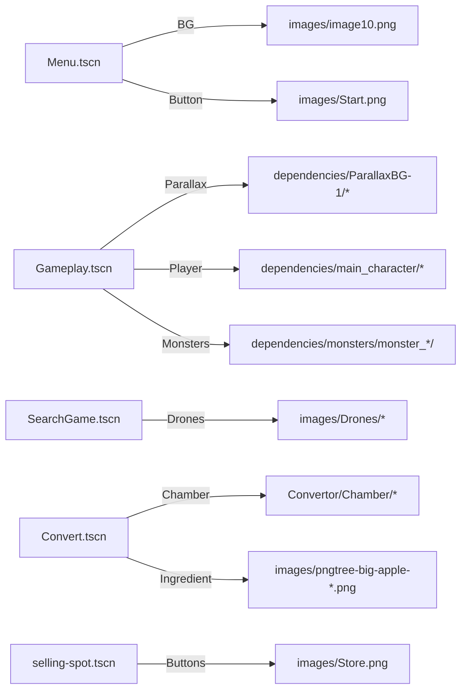

# Assets and Folders

This repo contains two Godot projects that share a similar folder layout. The documentation primarily refers to the Main project: `Monster-Cocktails-Main/Monster-Cocktails-Main`.

Top-level of the repository
- Monster-Cocktails-Main/Monster-Cocktails-Main — main Godot 4.5 project
- Monster-Cocktails-Menu/cryptocatchers-... — snapshot variant (similar scenes/scripts)
- markerplace/ — non-Godot assets (images for external marketplace/materials)
- docs/ — this documentation (Markdown with Mermaid diagrams)

Notable folders (Main project)
- Convertor/
  - Chamber/ — the crafting chamber’s scene and `chamber.gd`
  - `Convert.tscn` and `main-convert.gd`
  - `zombie.gd` — draggable item script used as placeholder ingredient
- Currency/
  - `currency_display.tscn` — autoloaded HUD overlay
  - `currency_display.gd` — HUD logic
- Game/
  - fixed/ — `global_inventory_fixed.gd` (autoload inventory)
  - player, camera, UI, and monster-related scripts and scenes
- Loading-Dependencies/
  - `loading.tscn`, `loading.gd` and their images
- Menu-Dependencies/
  - `menu.tscn`, `start.gd`, menu background images
- MusicManager/
  - `music_manager.gd` — autoload music logic
  - Music/ — `Game_1_OST.wav`, `Menu_OST.wav`
- SearchGame/
  - `search_game.tscn` and supporting scripts (`drones.gd`, `Backtocafe.gd`, `zone_*.gd`)
- selling-spot/
  - `selling-spot.tscn`, `start.gd`, marketplace buttons
- addons/GodotTogether/
  - Third-party addon for collaboration/multiplayer (client/server, GUI, chat)
- dependencies/
  - ParallaxBG-1 — layered parallax backgrounds
  - cocktails — cocktail illustrations
  - controls — UI button states (pressed/unpressed) for on-screen gamepad
  - main_character — sprites and components for the player
  - main_character_animation — run with/without hook animations
  - monsters/monster_1..4 — monster sprites/atlases
  - world — environment sprites (ground, coins under `monetki`, sun)
- images/
  - Drones/ and Drones/Scanning — images used by SearchGame
  - various UI/scene textures (Back.png, Start.png, etc.)

Asset usage map (selected)

Import settings
- The repository includes `.import` sidecar files generated by Godot; do not edit them manually
- Audio files (`*.wav`) are imported as `AudioStream` resources
- Textures are imported with defaults suitable for 2D (you can switch to “Lossless” for pixel-art)

Licensing
- This repository doesn’t include explicit asset licenses in the files scanned.
- If you plan to redistribute, add licenses for third-party packs under `LICENSES/` or `docs/Assets-Licenses.md`.

Tips
- Keep large original sources (e.g., PSD) outside `res://` to reduce import time and build size
- Use `dependencies/` for raw art and `images/` for scene-specific composites/exports
- Consider using `TexturePacker` or Godot’s AtlasTextures for monsters to reduce draw calls
