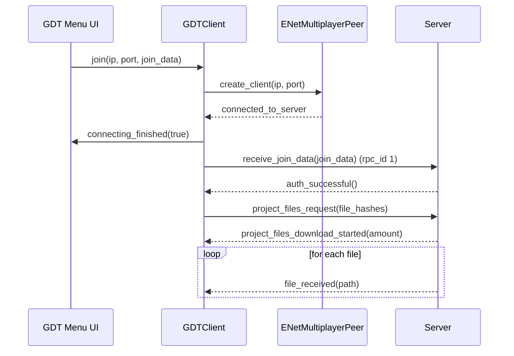

# Networking (GodotTogether)

Scope
- The project ships with the GodotTogether addon under `res://addons/GodotTogether/`
- Provides optional collaboration/multiplayer features: connect as server/client, user list, chat, and project file sync
- Not required for single-player gameplay; safe to disable in Project Settings → Plugins

Key components (addon)
- `src/scripts/net/client.gd` — class `GDTClient`: ENet client peer, join, auth, file sync requests
- `src/scripts/net/server.gd` — server-side counterpart
- `src/scenes/GUI/menu.tscn` and `menu.gd` — session control UI (host/join)
- `src/scenes/GUI/chat` — chat overlay
- `src/scenes/Avatar2D` and `Avatar3D` — example avatars for collaborative sessions
- `src/scripts/GodotTogether.gd` — root addon coordinator; creates the top-right session button (`GDTMenuButton`)

Client connect flow

Main signals (client)
- `connecting_finished(success: bool)` — emitted after ENet connection attempt
- `auth_succeed` — server accepted connection; proceeds to file sync
- `project_files_download_started(amount: int)` — indicates incoming file count
- `file_received(path: String)` — called per file
- `disconnected` — connection closed; reason available via `GDTUser.DisconnectReason`

Integration points in this project
- The addon’s top-right session button (menu) appears when the plugin is enabled; it allows hosting or joining a session during development
- Scenes do not directly depend on addon classes; you can run the game without the plugin
- If desired, you can add avatars (`Avatar2D.tscn`) as children of gameplay scenes to see remote peers

Security and production notes
- GodotTogether is primarily a development/education tool; not a production authoritative multiplayer stack
- For production multiplayer, implement a dedicated netcode layer (e.g., using `SceneTree.multiplayer` with custom authority, RPCs, and validation)

How to enable/disable
1. In Godot: Project → Project Settings → Plugins
2. Toggle GodotTogether to Enabled/Disabled

Extending
- Sync select gameplay nodes/variables by integrating with `GDTChangeDetector` or writing your own RPCs
- Bridge the chat UI to in-game events (e.g., show system messages when players craft cocktails)
- Add avatar spawning to gameplay scenes on session start
