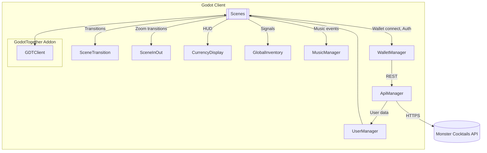
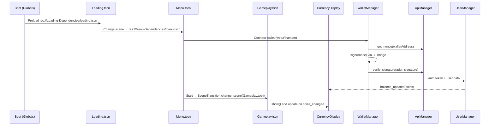

# Monster Cocktails — Monorepo README (Godot 4.5 + React/Vite)

Last updated: 2025-10-31 02:15 (local)

This repository is a monorepo that contains all Monster Cocktails projects:

1) Game (Godot 4.5, main development)
   - Path: Monster-Cocktails-Main/Monster-Cocktails-Main
   - Status: Primary, actively developed project

2) Menu Snapshot (Godot 4.5, historical snapshot: CryptoCatchers)
   - Path: Monster-Cocktails-Menu/cryptocatchers-YYYY-MM-DD-...
   - Status: Timestamped snapshot with similar structure/content. Use Main for development.

3) Marketplace Web App (React + Vite + Tailwind, Solana wallet integration)
   - Path: markerplace/markerplace
   - Status: Web marketplace / companion app
   - Key deps: @solana/web3.js, Wallet Adapter (React UI), axios, lucide-react, TailwindCSS

Contents
- Monorepo map (all projects)
- Quick start — per project
- Godot game overview: scenes, autoloads, systems
- Networking (GodotTogether addon)
- Inputs and assets
- Build/run/export
- Contributing & coding style
- Glossary and deep dives

Monorepo map
- Monster-Cocktails-Main/Monster-Cocktails-Main
  - Convertor/
  - Currency/
  - Game/
  - Loading-Dependencies/
  - Menu-Dependencies/
  - MusicManager/
  - SearchGame/
  - addons/GodotTogether/
  - dependencies/
  - images/
  - selling-spot/
- Monster-Cocktails-Menu/cryptocatchers-YYYY-MM-DD-...
  - Similar structure to Main (Convertor, Game, SearchGame, addons, etc.)
- markerplace/markerplace
  - src/
  - src/img/
  - package.json, vite config, Tailwind config
- docs/
  - Systems/ (Inventory, Currency, Converter, Music, SearchGame)
  - diagr/ (mermaid and other diagrams)

Quick start — Game (Godot)
1) Install Godot 4.5 (GL Compatibility renderer recommended/configured).
2) Open project.godot from one of the Godot projects:
   - Main: Monster-Cocktails-Main/Monster-Cocktails-Main/project.godot
   - Snapshot: Monster-Cocktails-Menu/cryptocatchers-.../project.godot
3) Press F5 to run.

Main Godot entry scenes
- Main menu: res://Menu-Dependencies/menu.tscn
- Gameplay: res://Game/Gameplay.tscn
- Search mode: res://SearchGame/search_game.tscn
- Converter: res://Convertor/Convert.tscn
- Selling spot: res://selling-spot/selling-spot.tscn
- Loading: res://Loading-Dependencies/loading.tscn

Autoloaded singletons (Main project)
From Monster-Cocktails-Main/Monster-Cocktails-Main/project.godot:
- Globals → res://globals.gd
- SceneTransition → res://SceneTransition.gd
- SceneInOut → res://SceneInOut.gd
- CurrencyDisplay → res://Currency/currency_display.tscn
- WalletManager → res://wallet_manager.gd
- ApiManager → res://api_manager.gd
- UserManager → res://user_manager.gd
- MusicManager → res://MusicManager/music_manager.gd
- GlobalInventory → res://Game/fixed/global_inventory_fixed.gd

High-level architecture (Godot client)

Typical scene flow

Marketplace Web App (markerplace/markerplace)
- Stack: React 18 + Vite 7 + TailwindCSS, Solana Wallet Adapter, @solana/web3.js
- Scripts (package.json):
  - dev: vite
  - build: vite build
  - preview: vite preview
- Run locally:
  - cd markerplace/markerplace
  - npm install
  - npm run dev
- Build:
  - npm run build
  - npm run preview

Networking (GodotTogether)
- The Godot projects include the addon at: addons/GodotTogether
- Provides lobby/chat/avatars and network helpers. See addon README files:
  - Monster-Cocktails-Main/.../addons/GodotTogether/README.md
  - Monster-Cocktails-Menu/.../addons/GodotTogether/README.md
- Docs: ./Networking.md

Inputs & controls
- See ./Inputs.md for keymaps and controller mappings.

Assets & folders
- See ./Assets.md for art, audio, and dependency folders.
- Shared art and animations live under dependencies/ and images/.

Build / Export
- Godot: use Project → Export. Profiles may be included in the project; adjust renderer to GL Compatibility if needed for older GPUs.
- Web app: Vite build outputs to dist/ (configure deploy target as needed).

Contributing & style
- Follow Godot GDScript style and existing folder conventions.
- For web app, follow standard React + Tailwind component organization.
- See ./Contributing.md for coding style and review process.

Deep dives and references
- Architecture: ./Architecture.md
- Scenes: ./Scenes.md
- Scripts & APIs: ./Scripts.md
- Systems
  - Inventory: ./Systems/Inventory.md
  - Currency HUD: ./Systems/Currency.md
  - Converter: ./Systems/Converter.md
  - Music: ./Systems/Music.md
  - Search Game (Drones): ./Systems/SearchGame.md
- Networking: ./Networking.md
- Inputs: ./Inputs.md
- Assets: ./Assets.md
- Glossary: ./Glossary.md

Notes
- CurrencyDisplay overlays on top of all scenes but hides on loading and menu.
- MusicManager tracks the active scene and switches tracks accordingly.
- Prefer the Main Godot project for ongoing development; snapshot is for reference.
