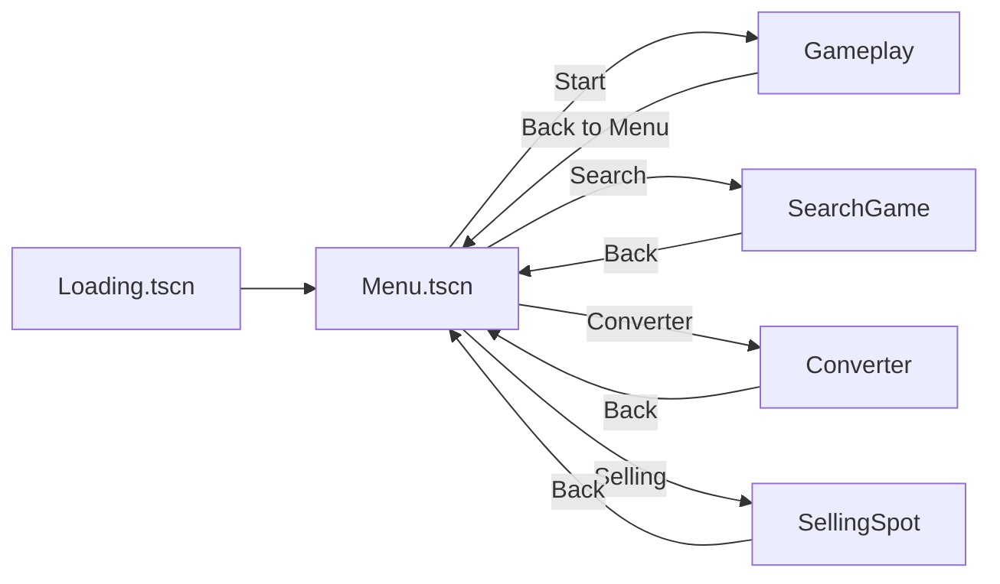

# Scenes Reference

This document lists key scenes in the Monster Cocktails Main project, their purpose, notable child nodes, and attached scripts. Paths are relative to `res://` of the Main project unless specified otherwise.

Scene index
- Menu — res://Menu-Dependencies/menu.tscn
- Gameplay — res://Game/Gameplay.tscn
- Search Game — res://SearchGame/search_game.tscn
- Converter — res://Convertor/Convert.tscn
- Selling Spot — res://selling-spot/selling-spot.tscn
- Loading — res://Loading-Dependencies/loading.tscn
- Currency HUD (autoload) — res://Currency/currency_display.tscn

Scene flow (overview)

Menu — menu.tscn
- Path: res://Menu-Dependencies/menu.tscn
- Purpose: Main entry UI. Start button launches the game. Hidden placeholders for Settings/User.
- Key nodes:
  - Node2D: Menu (root)
  - Button: Start → shows `Start` texture; script `res://Menu-Dependencies/start.gd` handles `_on_pressed` to change scene via `SceneTransition` or `get_tree().change_scene_to_file`.
- Assets: `res://images/image10.png`, `res://images/Start.png`

Gameplay — Game/Gameplay.tscn
- Path: res://Game/Gameplay.tscn
- Purpose: Main platforming scene with player, parallax background, monsters, UI controls, and pause menu.
- Notable external resources (subset):
  - Player logic: `res://Game/player_improved.gd`
  - Camera: `res://Game/camera_2d.gd`
  - UI Root: `res://Game/ui_root.gd`
  - Pause UI: `res://pause_ui.gd`
  - Monster UI: `res://Game/monster_ui_display.gd`
- Notes: Integrates with `GlobalInventory` to update monster/cocktail counts and coins during play.

Search Game — SearchGame/search_game.tscn
- Path: res://SearchGame/search_game.tscn
- Purpose: Drone-based timed search mode with zones and back-to-cafe button.
- Attached scripts:
  - `res://SearchGame/drones.gd` — orchestrates drones, timer UI overlay, and search logic.
  - `res://SearchGame/zone_1.gd`, `zone_3.gd` — zone behaviors/handlers (area triggers, spawns, etc.).
  - `res://SearchGame/Backtocafe.gd` — back button behavior to return to menu.
- Notes: Drones create an in-game timer overlay using a `CanvasLayer` on the root to sit above the scene.

Converter — Convertor/Convert.tscn
- Path: res://Convertor/Convert.tscn
- Purpose: Combine collected monsters (zombies/apples as placeholders) into cocktails using a Chamber.
- Composition:
  - `Chamber` instance: `res://Convertor/Chamber/Chamber.tscn` with script `res://Convertor/Chamber/chamber.gd`
  - `CocktailInventory` instance: `res://Convertor/cocktail_inventory.tscn` for displaying craftable cocktails
  - `Zombie` Area2D: script `res://Convertor/zombie.gd` for draggable ingredient entity
  - Back button: `res://SearchGame/Backtocafe.gd`
- Notes: `chamber.gd` exposes signals: `zombie_added`, `zombie_removed`, `chamber_full`, `processing_started`, `cocktail_ready(cocktail_name, sell_price)`.

Selling Spot — selling-spot/selling-spot.tscn
- Purpose: Sell crafted cocktails or monsters for coins; launch mini-scenes (e.g., market).
- Scripts: `res://selling-spot/start.gd` and button scripts under `res://selling-spot/`.
- Notes: May route to SearchGame via `Globals.next_scene`.

Loading — Loading-Dependencies/loading.tscn
- Purpose: Splash/loading scene displayed on boot, then transitions into the Menu.
- Script: `res://Loading-Dependencies/loading.gd`.

Currency HUD — Currency/currency_display.tscn
- Purpose: Autoloaded HUD overlay that displays current coin count.
- Script: `res://Currency/currency_display.gd`.
- Behavior: Hides automatically on Loading and Menu scenes; shows elsewhere. Listens to `GlobalInventory.coins_changed`.

Scene transition helpers (autoloads)
- `res://SceneTransition.gd` — full-screen fade transition service.
- `res://SceneInOut.gd` — camera zoom-in/zoom-out transition service.

Notes on the Menu snapshot project
- The CryptoCatchers (Menu) snapshot mirrors most scenes under `Monster-Cocktails-Menu/cryptocatchers-...` with similar scripts and flows. Prefer the Main project for active development and testing.
