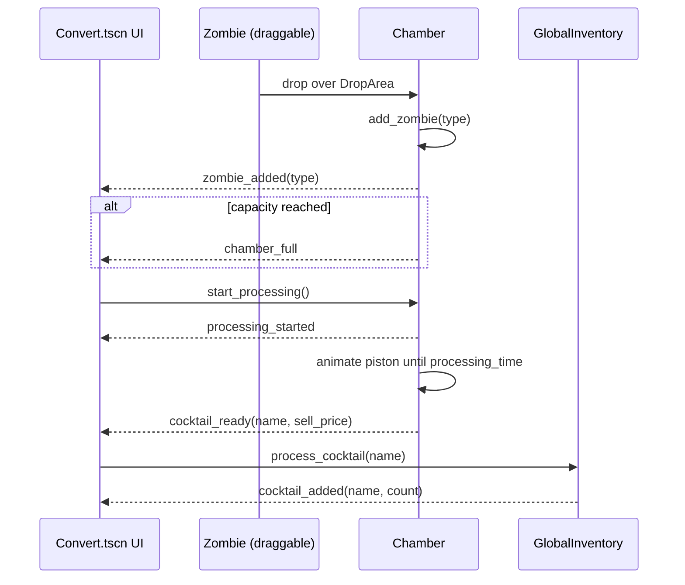

# Converter System

Scope
- Interactive crafting of cocktails from collected monsters (represented by draggable "zombies" in the current prototype)
- Core scene: `res://Convertor/Convert.tscn`
- Core scripts: `res://Convertor/Chamber/chamber.gd`, `res://Convertor/zombie.gd`, `res://Convertor/main-convert.gd`

Key nodes (Convert.tscn)
- `Chamber` (instance of `Chamber.tscn`) — accepts dragged ingredients; performs processing
- `Zombie` (Area2D) — draggable ingredient item; Apple sprite in the prototype
- `CocktailInventory` — UI panel listing craftable cocktails and counts
- `Button` with `Backtocafe.gd` — navigation back to the previous scene (menu)

Chamber (chamber.gd) responsibilities
- Maintain capacity (`max_zombies`, default 3)
- Manage drag-over feedback and accept drops
- Track list of ingredients with per-item display slots
- Animate processing (piston-like scale effect)
- Emit signals for UI/gameplay to react
  - `zombie_added(zombie_type)`
  - `zombie_removed(zombie_type)`
  - `chamber_full`
  - `processing_started`
  - `cocktail_ready(cocktail_name, sell_price)`

Converter flow

Chamber data and exports
- `@export var max_zombies: int = 3`
- `@export var processing_time: float = 10.0`
- `@export var zombie_slot_spacing: float = 40.0`
- `@export var piston_speed: float = 1.5`

Integration with inventory
- `GlobalInventory.transfer_monster_to_converter(name)` reduces inventory when added to chamber
- `GlobalInventory.process_cocktail(name)` increases cocktail counts and/or coins

UI behaviors
- `capacity_label` shows "x/y"
- `timer_label` shows remaining processing time
- Visual pulse on chamber sprite during processing

Extending
- Add recipe definitions mapping ingredient sets → cocktail outputs
- Add failure outcomes and random bonuses
- Replace placeholder zombie Apple sprite with actual monster drops
- Save/restore current chamber state across scene switches
