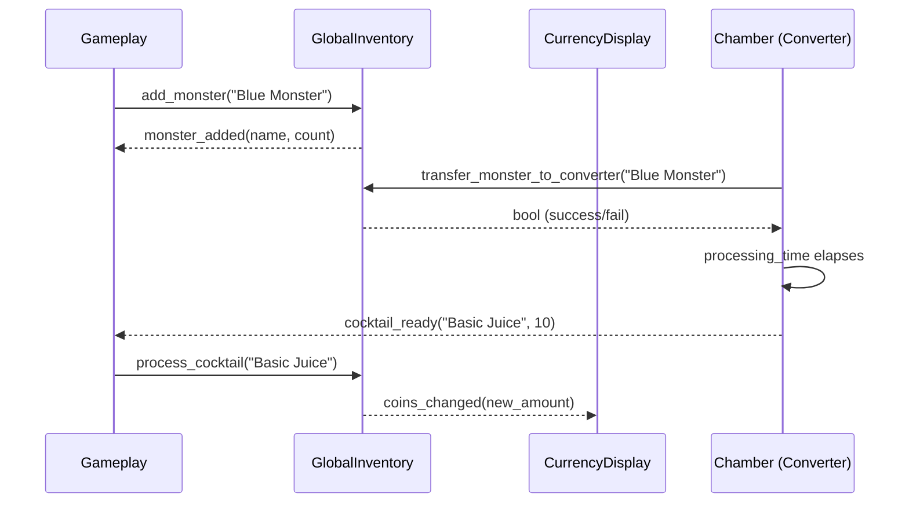
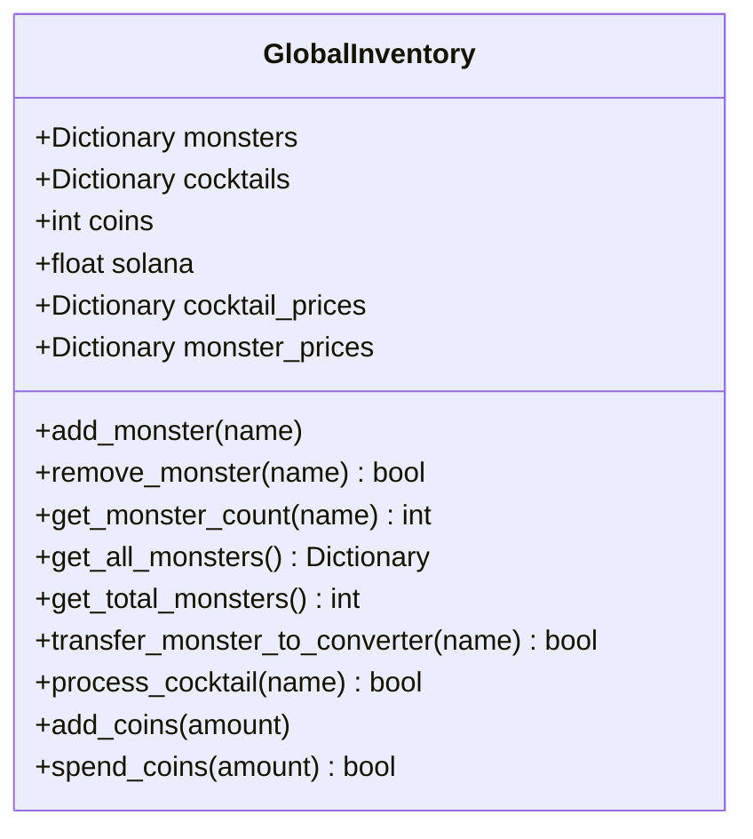

# Inventory System

Scope
- Game-side inventory of monsters, cocktails, and coins managed by the autoload `GlobalInventory` (res://Game/fixed/global_inventory_fixed.gd)
- Consumed by scenes (Gameplay, Converter, Selling Spot) and HUD (CurrencyDisplay)
- Optionally synchronized from blockchain token balances via `UserManager.fetch_token_balances()`

Responsibilities
- Maintain counts for monsters and cocktails
- Maintain coin and SOL balances
- Expose price tables for selling and crafting
- Emit signals for UI and logic to react

Key script: res://Game/fixed/global_inventory_fixed.gd
- Data
  - `monsters: Dictionary` → Blue, Purple, Violet, Orange Monster
  - `cocktails: Dictionary` → Basic Juice, Double Mix, Triple Blast
  - `coins: int`, `solana: float`
  - `cocktail_prices` and `monster_prices`
- Signals
  - `monster_added(name, new_count)` / `monster_removed(name, new_count)`
  - `cocktail_added(name, new_count)` / `cocktail_removed(name, new_count)`
  - `coins_changed(new_amount)` / `solana_changed(new_amount)`
- Typical interactions
  - Gameplay scene calls `add_monster(monster_name)` when a monster is captured.
  - Converter calls `transfer_monster_to_converter()` and `process_cocktail()` to craft drinks.
  - Selling spot calls `add_coins()` when items are sold.
  - Currency HUD listens to `coins_changed` to update the coin display.

Signals and flows

Data model

Best practices
- Always use the provided functions so signals are emitted; do not mutate dictionaries directly.
- When adding new monster or cocktail types, update both the dictionary and the respective price table.
- For UI, subscribe to signals instead of polling.

Extending the system
- Add persistence by saving `monsters`, `cocktails`, and `coins` to `user://savegame.tres`.
- Map blockchain tokens to cocktails and update counts in `UserManager.sync_inventory_from_tokens()`.
- Add rarity tiers impacting `monster_prices` and converter `processing_time`.
