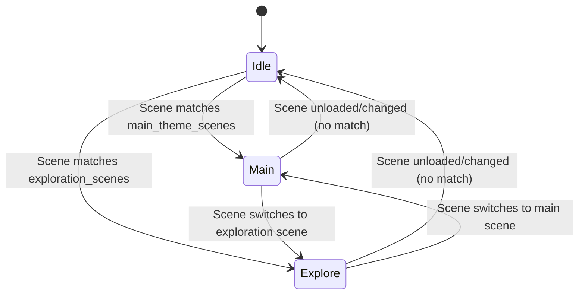

# Music System

Scope
- Scene-aware background music managed by the autoload `res://MusicManager/music_manager.gd`
- Chooses between two exported tracks (main and exploration) based on the active scene
- Supports per-track start offsets, fixed-length playback, and looping

Key script: res://MusicManager/music_manager.gd
- Player creation
  - Dynamically instantiates one `AudioStreamPlayer` named `Player`
  - Audio bus: `Master` (adjust in the inspector if needed)
- Exported streams
  - `@export var main_theme: AudioStream = preload("res://MusicManager/Music/Game_1_OST.wav")`
  - `@export var exploration_theme: AudioStream = preload("res://MusicManager/Music/Menu_OST.wav")`
- Volume controls
  - `@export var main_theme_volume_db: float = -15.0`
  - `@export var exploration_volume_db: float = -15.0`
- Track length and loop settings
  - `main_theme_start_time`, `main_theme_length`, `main_theme_loop`
  - `exploration_theme_start_time`, `exploration_theme_length`, `exploration_theme_loop`
  - Uses a one-shot `Timer` to stop or loop precisely at `*_length` seconds
- Scene-based selection
  - `main_theme_scenes`: includes `menu.tscn`, `Game/Gameplay.tscn`
  - `exploration_scenes`: includes `SearchGame/search_game.tscn`, `selling-spot/selling-spot.tscn`, `Convertor/Convert.tscn`
- Debugging
  - `@export var enable_debug_logs: bool` enables verbose logging of scene changes and music state

Behavior
```mermaid
sequenceDiagram
    participant Tree as SceneTree
    participant MM as MusicManager
    participant Player as AudioStreamPlayer

    MM->>MM: _ready() → create Player, Timer, subscribe to scene load
    Tree-->>MM: child_entered_tree (root child)
    MM->>MM: detect scene path
    alt in main_theme_scenes
        MM->>Player: stream = main_theme; volume_db = main_theme_volume_db
        MM->>Player: seek(main_theme_start_time); play()
        MM->>MM: start Timer if main_theme_length > 0
    else in exploration_scenes
        MM->>Player: stream = exploration_theme; volume_db = exploration_volume_db
        MM->>Player: seek(exploration_theme_start_time); play()
        MM->>MM: start Timer if exploration_theme_length > 0
    else unknown
        MM->>Player: stop()
    end
    MM-->>MM: on Timer timeout → loop or stop
```

State machine


Extending
- Add more categories by introducing `boss_theme` or `market_theme` with a separate scenes list
- Integrate with a global Settings menu to adjust volume and mute
- Switch to `AudioStreamPlayer2D` per-level for positional ambience while retaining MusicManager for non-diegetic tracks
- Persist last played track and seek time across scene reloads (e.g., after pause)
